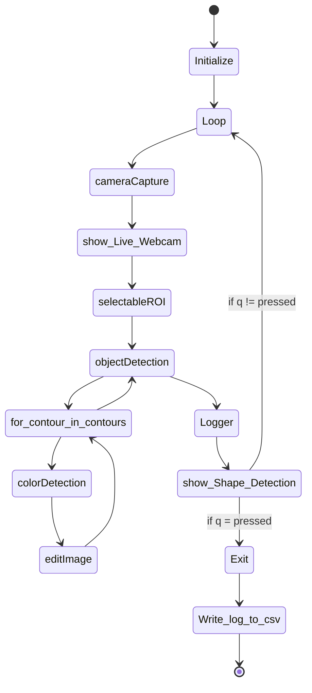

# SWENG_PROJ_objectDetection
## Live Object Pattern Recognition and Color Detection

# Overview
SWENG_PROJ_objectDetection is a small Python application that uses the livestream of a camera and performs real-time 
object pattern recognition and color detection. The recognition is visualized within the livestream and the 
information gathered is logged into a csv file for later analysis. 
The code is part of the module SoftwareEngineering at the University of Applied Sciences Grisogns.


# Setup
## Prerequisites
1. Python Enviroment on your Windows PC
2. Camera

## Installation
step-by-step instructions for installing SWENG_PROJ_objectDetection. 

1. clone the SWENG_PROJ_objectDetection repository  
```
git clone https://github.com/germi2000/SWENG_PROJ_objectDetection.git
```
2. setup the poetry venv  
```
poetry shell
```
3. select the poetry venv

# Features
Describe the key features of your application. Each feature should have its own section.

## cameraCapture.py
A Class named Camera for capturing video frames from a camera using the OpenCV library. 
1. Initialization: Creates a camera instance based on the provided camera index (default is 0).
2. Error Handling: Raises an error if the camera cannot be opened.
3. Capture Frame: Captures and returns a video frame as a NumPy array.
4. Release: Provides a method to release the camera when no longer needed. Useful for freeing system resources.

## colorDetection.py
A Class named ColorDetector for detecting the color of a object in an image based on its 
HSV (Hue, Saturation, Value) values. The class has the following features:
1. Color Classification: Classify the HSV values of the colors: Red, Green, Blue, Yellow and Violet.
2. Detect Color: Given an image and pixel coordinates, it converts the image to HSV, extracts a small region around the pixel, calculates the average color, and classifies it.

## editImage.py
A class named Labeling for labeling shapes and their colors in an image. This class is intended for image processing and analysis and has the following features:
1. Label Shape: Labels detected shapes in images, calculating centroids and colors and adding text labels.
2. Draw Contour: Draws a contour around detected shapes in images.

## logger.py
A class named Logger for logging detected shapes and their colors to a CSV file. This class is designed to interact with a user interface for selecting the log file path. Here are the key features:
1. Select Log File: Allows users to choose a log file path using a file dialog, with a default filename and location.
2. Write Data: Writes detected shape data to the selected CSV file, handling file selection and data writing. Useful for logging data in applications.

## objectDetection.py
A class named ShapeDetector that detects shapes in an image and labels them. It uses the OpenCV library for image processing and relies on the Labeling class for editing the image and the ColorDetector class for color detection. Here are the key features:
1. Detect Shapes: Processes an input image, identifies shapes, labels them, and stores the shape information in a list.

## selectableROI.py
A class named ROISelector for selecting a Region of Interest (ROI) in an image using mouse interactions. Here are the key features:
1. Interactive ROI Selection: Allows users to draw a rectangle using mouse interactions to select an area of interest within an image.
2. Output ROI: Extracts the selected ROI from the input image, returning it for further processing. If no ROI is selected, the original image is returned.

# Getting Started
1. select camera_index in the main.py file
```
# Camera init
    camera = Camera(camera_index=0)
```
2. Start the main.py file in your python Enviroment
3. Select the ROI in the "_Live Webcam_" window  
__note: select the upper left corner first,then lower right__

# runtime view diagram


